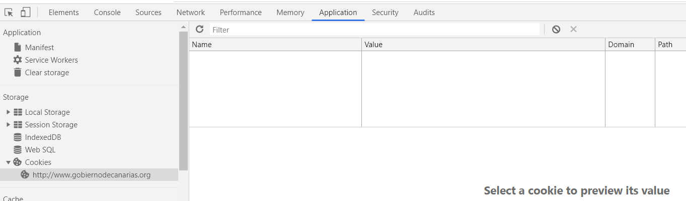

## Practica 1 de la asignatura Usabilidad y Accesibilidad


## [Link 1](http://www.gobiernodecanarias.org/istac/api/)

### ¿Qué peticiones desencadena la consulta?

La consulta desencadena una peticion de documento HTML, dos de CSS, 5 de imagenes, con la de favicon fallando.
### ¿Qué tipo de petición estás realizando?

Las peticiones realizadas son exclusivamente HTTP de tipo GET, ya que la pagina no necesita ninguna informacion que provea el usuario, es meramente informativa.

### ¿Qué código de estatus devuelve?

Los codigos de respuesta son:

- 200 OK
- 302 Found
- 302 Found
- 302 Found
- 200 OK
- 200 OK
- 200 OK
- 404 Not Found (en el favicon)

### ¿Qué DNS tiene el servidor?

http://www.gobiernodecanarias.org

### ¿Qué IP tiene tiene el servidor?

93.188.137.123

### ¿La página tiene alguna cookie?, ¿Cuáles?

No tiene cookies


### ¿Qué idioma acepta?.

El parametro Accept-Language depende de la maquina que haga la solicitud, en el caso de nuestro grupo, en los ordenadores que estan en español el valor es `es-ES, es; q=0.9`, pero en otro ordenador que esta en ingles, el valor de dicho parametro es `en-GB,en;q=0.9,en-US;q=0.8,es;q=0.7`

### Alguna línea de código JavaScript


### Alguna línea de código CSS que se aplique


### Alguna línea de código HTML que se aplique


## [Link 2](http://www3.gobiernodecanarias.org/sanidad/scs/gc/18/Cita_Previa/index.html)

### ¿Qué peticiones desencadena la consulta?


### ¿Qué tipo de petición estás realizando?


### ¿Qué código de estatus devuelve?


### ¿Qué DNS tiene el servidor?

http://www3.gobiernodecanarias.org/

### ¿Qué IP tiene tiene el servidor?

La ip del servidor es: 93.188.136.126:80

### ¿La página tiene alguna cookie?, ¿Cuáles?

La página dispone de cookies para analitica : _ga=GA1.2.2009145986.1577728853

### ¿Qué idioma acepta?.

El idioma acceptado por espa pgina será : `es-ES,es;q=0.9`


### Alguna línea de código JavaScript

```javascript
  
    this.options.remote && this.$element.find('.modal-body').load(this.options.remote)
  
```

### Alguna línea de código CSS que se aplique

```css
.bloque-dia, .bloque-hora {
    float: left;
    width: 110px;
    border: 1px solid #ddd;


```

### Alguna línea de código HTML que se aplique

```htmml
<h1 style="font-size:32px;">Cita previa</h1>
```
