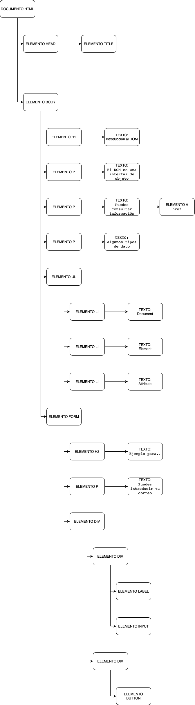

```HTML
<!DOCTYPE>
<html >
  <head>
    <title>DOM</title>
  </head>
  <body>
    <h1>Introducción al árbol DOM</h1>
    <p>El DOM es una interfaz de objeto de un documento HTML, representa de forma estructurada el documento  y proporciona interfaces para su manipulación</p>
    <p>Puedes consultar información en la <a href="https://developer.mozilla.org/es/docs/Referencia_DOM_de_Gecko/Introducci%C3%B3n">
      Documentación de Mozilla
    </a></p>
    <p> Algunos tipos de datos:</p>
    <ul>
      <li>document</li>
      <li>element</li>
      <li>attribute</li>
      
    </ul>
    <p>Introduce tu correo si quieres más información </p>
    <form  action="https://www.ull.es/" method="post">
      <h2>Ejemplo para el árbol DOM</h2>
      <p>Puedes introducir tu correo, si quieres suscribirte</p>
      
      <div>
        <div>
          <label for="newsletterEmailInput">E-mail</label>
          <input type="email" id="newsletterEmailInput" name="email" required="" placeholder="you@example.com" size="30">
            </div>
        <div>
          <button id="newsletter-submit" type="submit" class="button neutral newsletter-submit">Sign up now</button>
        </div>
      </div>
    </form>
  </body>
</html>
```

