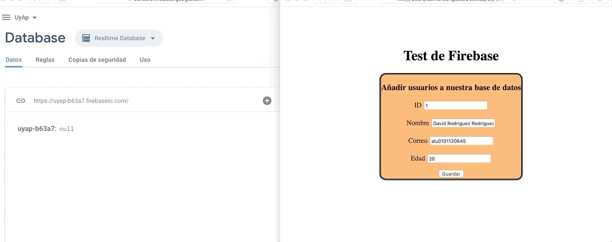
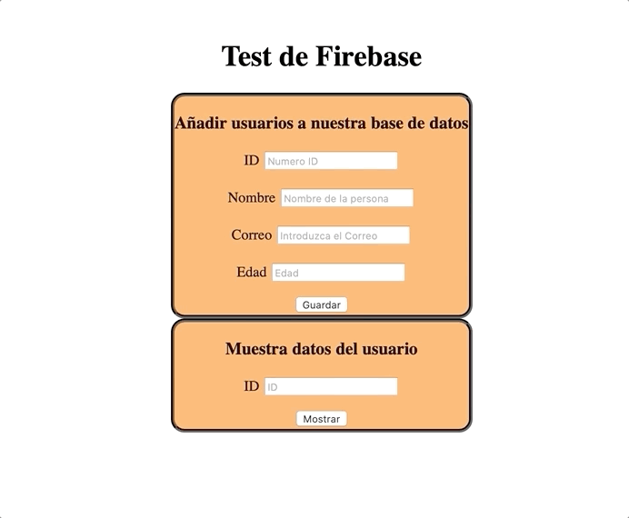

# Practica 7 Introduccion Firebase I

## Integrantes grupo 18.

### Eduardo Ernesto Brito Sanchez
### David Rodriguez Rodriguez
### Sergio Torres Rodriguez

## Añadir nuevos usuarios a la base de datos.



## Modificar datos

Para modificar los datos de un usuario que ya tengamos en la base de datos unicamente necesitamos poner el id del usuario que queremos modificar y se cambiaran los datos de este.

## Funcion para Guardar datos en la base de datos


```js
guardar.onclick = () => {
            console.log("casa2")
        id = document.getElementById("Id").value;
        nombre=document.getElementById("Nombre").value;
        correo=document.getElementById("Correo").value;
        edad=document.getElementById("Edad").value;
        var referencia = database.ref('Usuarios/' + id);
            console.log(nombre);
            console.log(correo);
            console.log(edad);
        const data = {
                'Nombre': nombre,
                'Correo': correo,
                'Edad': edad 
            };
        
        referencia.set(data);
    }
```

## Mostrar Usuarios por ID 


