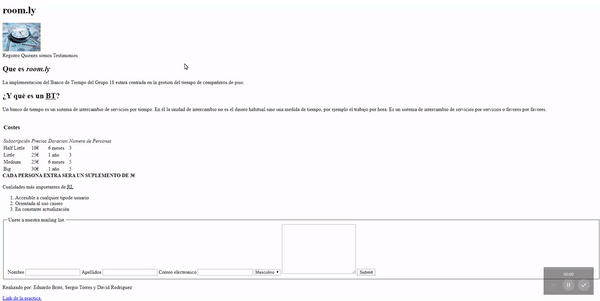
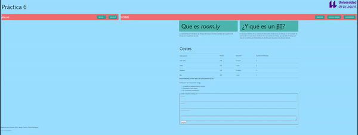

# WAI-ARIA

Para esta práctica hemos revisados las páginas creadas anteriormente con la extension de Google llamada Chrome Vox, que el funcionamiento de la web no es el correcto cuando se usa el teclado. Para solucionarlo, se usaron las etiquetas de WAI-ARIA para que fuera posible una navegacion por teclado simple y descriptiva, facilitando así el trabajo de los potenciales lectores de pantalla, obteniendo como resultado un página notablemente mas accesible.

## Práctica-2

## Práctica-4

